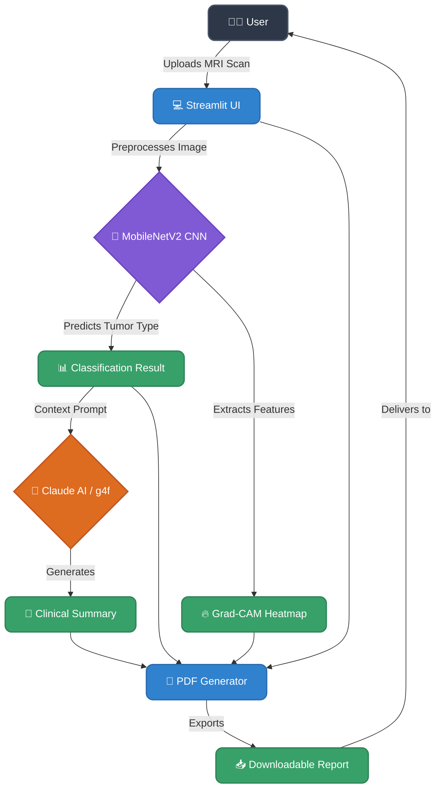

# 🧠 NeuroScan AI — Brain Tumor Diagnostics Console

[](https://neuroscan-diagnostics.streamlit.app)
[](https://python.org)
[](https://tensorflow.org)
[](https://opensource.org/licenses/MIT)

NeuroScan AI is a state-of-the-art diagnostic assistant that leverages Deep Learning to detect brain tumors from MRI scans. It provides medical professionals with interpretable AI insights, including tumor classification, visual attention maps (Grad-CAM), and AI-generated clinical reports.

> **⚠️ Disclaimer:** This application is for educational and demonstrational purposes only. It is not a substitute for professional medical diagnosis.

---

## 🚀 Live Demo
**Try the live application here:** 👉 **[NeuroScan AI Console](https://neuroscan-diagnostics.streamlit.app)**

---

## ✨ Key Features
- **🔬 Deep Learning Classification**: Utilizes a highly optimized `MobileNetV2` Convolutional Neural Network (CNN) to classify MRI scans into four categories (Glioma, Meningioma, Pituitary, or No Tumor).
- **🔥 Explainable AI (Grad-CAM)**: Generates a heat map overlaid on the original MRI to show exactly *where* the model is looking to make its prediction, building trust and interpretability.
- **🤖 AI Medical Summaries**: Integrates with cutting-edge LLMs (via `g4f` / Claude AI) to automatically generate comprehensive clinical summaries based on the detected tumor type.
- **📄 Instant PDF Export**: Compiles the MRI, Grad-CAM heatmap, classification results, and AI clinical summary into a highly professional, downloadable medical PDF report.
- **🌐 Multilingual Support**: Generates AI reports in both **English** and **Hinglish**.

---

## 🏗️ Architecture & Workflow

The application follows a streamlined, modern AI workflow from image upload to clinical report generation:



---

## 🛠️ Technology Stack
- **Frontend & Deployment**: Streamlit, Streamlit Cloud
- **Deep Learning**: TensorFlow / Keras (MobileNetV2)
- **Computer Vision**: OpenCV, Pillow, NumPy
- **Generative AI**: `g4f` (Free GPT-4 / Claude API)
- **Document Generation**: ReportLab

---

## 💻 Local Installation

If you want to run this project locally on your machine, follow these steps:

### 1. Clone the repository
```bash
git clone https://github.com/ajay160380/NeuroScan-AI-Brain-Tumor-Diagnostics-Console.git
cd NeuroScan-AI-Brain-Tumor-Diagnostics-Console
```

### 2. Create a virtual environment
```bash
python3 -m venv .venv
source .venv/bin/activate  # On Windows use: .venv\Scripts\activate
```

### 3. Install dependencies
```bash
pip install -r requirements.txt
```

### 4. Run the application
```bash
streamlit run app.py
```

---

## 🤝 Contributing
Contributions, issues, and feature requests are welcome! Feel free to check the [issues page](https://github.com/ajay160380/NeuroScan-AI-Brain-Tumor-Diagnostics-Console/issues).

## 📝 License
This project is [MIT](https://opensource.org/licenses/MIT) licensed.
